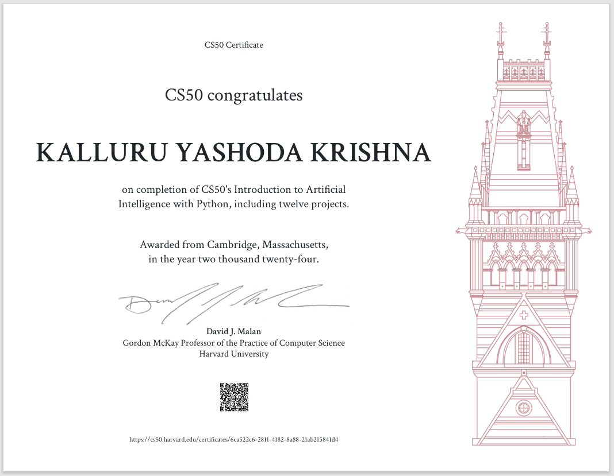

# CS50 AI 
Mine solutions for CS50's Introduction to Artificial Intelligence with Python course

*Warning : before visiting this repo files, please read about [CS50's Academic Honesty rules](https://cs50.harvard.edu/college/2021/fall/syllabus/#academic-honesty)*.

## Includes:
* Quizzes answers
* Projects solutions

## Course info:
* __Name:__ CS50's Introduction to Artificial Intelligence with Python
* __University:__ Harvard University
* __WWW:__ https://cs50.harvard.edu/ai/2020/

"# CS50-AI" 
